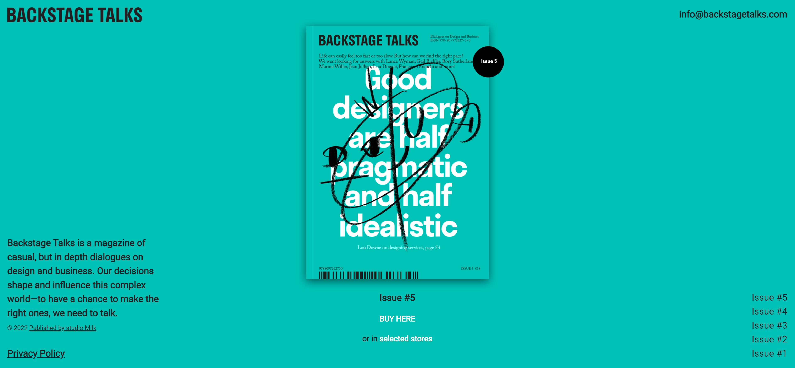

# Backstage Talks Recreation with Scroll Snapping and Animated Background-Color Transitions

This application is a recreation of the [Backstage Talks Magazine](https://backstagetalks.com/) website. It is one of the practice projects from [Frontend Practice](https://www.frontendpractice.com/project/backstage-talks). View my [version live](https://backstage-talks.netlify.app/).

## Motivation

This project allowed be to practice and further hone my front-end dev skill recreating websites from a "template". I was able to practice using fixed positioning with the header and footer elements. It also gave me more practice within the react library creating reusable components. Each section, or magazine issue, was one reusable Issue component which rendered differently based on the props input to each intstance.

## What I learned

I learned how to implement Scroll Snapping with response to both screen width and height as well as hide the scroll bar when scroll snapping is active. I also figured out how to animate background-color changes based on scroll position using the **window.scrollY** property of the Window interface.

## Credits

[BACKSTAGE TALKS](https://backstagetalks.com/),
[Frontend Practice](https://www.frontendpractice.com/project/backstage-talks),
[Create React App](https://github.com/facebook/create-react-app)
